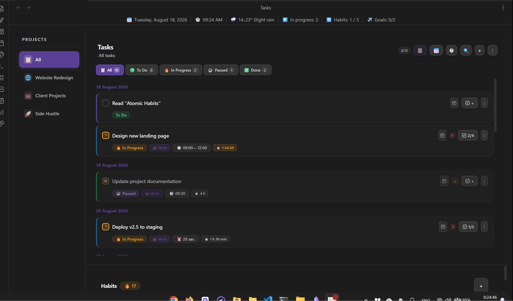

# WorkLife Calendar for Obsidian

> **Всё в одном:** умный календарь, трекер задач и привычек, учёт времени и финансовый планировщик, связанные в единую экосистему внутри Obsidian.

<div align="center">

[](https://opensource.org/licenses/MIT)
[](https://obsidian.md)
[](https://svelte.dev/)
[](https://www.typescriptlang.org/)


</div>

---



[**English README**](https://github.com/AtinsS/WorkLife-Calendar-for-Obsidian/blob/master/README.md)

## 💡 Почему этот плагин существует

У многих рабочих процессов одна и та же проблема: задачи живут в одном месте, календарь — в другом, учёт времени — в третьем, а финансы и отчёты собираются вручную в таблицах. В итоге одни и те же данные приходится вводить несколько раз.

**Этот плагин решает именно эту боль.** Он не просто добавляет ещё один календарь или трекер. Он связывает планирование, выполнение и анализ в одной системе:
- Одна задача влияет на календарь.
- Календарь влияет на учёт времени.
- Время влияет на расчёт дохода.
- Доход формирует автоматическую аналитику.
- **Мобильный опыт:** работа с задачами из телефона в Obsidian без лишней боли.

---

## 🚀 Для кого это

- **Фрилансеры и разработчики**, которым нужно считать стоимость работы по ставке.
- **Дизайнеры и консультанты**, ведущие несколько проектов одновременно.
- **Студенты и исследователи**, которым важна связка дедлайнов, привычек и продуктивности.
- **Любители автоматизации**, которые хотят, чтобы система работала за них (уведомления, синхронизация, отчёты).

---

## ⚙️ Основной Workflow

```text
Проект 
  ↓
Задача (с оценкой времени и ставкой)
  ↓
Календарь / Расписание (планирование слотов)
  ↓
Учёт времени (факт vs план)
  ↓
Доход и расходы (авторасчёт)
  ↓
Аналитика (графики и отчёты)
```

---

## 📦 Установка

### Через BRAT (Рекомендуется)
1. Установите плагин [BRAT](https://github.com/TfTHacker/obsidian42-brat).
2. Откройте настройки BRAT → **Add Beta Plugin**.
3. Вставьте ссылку: `https://github.com/AtinsS/obsidian-calendar-plugin-remastered`
4. Нажмите **Add Plugin**.

### Вручную
1. Скачайте архив или клонируйте репозиторий.
2. Скопируйте `main.js`, `manifest.json` и `styles.css`.
3. Поместите их в папку `.obsidian/plugins/calendar-plugin-remastered/` (создайте её, если нет).
4. Включите плагин в *Настройки → Сторонние плагины*.

---

## ☕ Поддержка / Support

Если плагин экономит ваше время и помогает в работе, вы можете поддержать разработку:
- ⭐ Поставьте звезду репозиторию.
- [☕ Угостить автора кофе с булочкой](https://pay.cloudtips.ru/p/cbaa3c81).

---

<details>
<summary><h3>✨ Подробные возможности (раскрыть)</h3></summary>

### 📅 Календарь и расписание
- Полноценный вид (день / неделя / месяц) на базе библиотеки **FullCalendar** с поддержкой drag & drop.
- Визуальные индикаторы задач и привычек прямо в сетке календаря.
- Создание задач кликом и изменение времени перетаскиванием.
- **Погода** на каждый день недели (Open-Meteo API, без ключей) для видимого диапазона дат.
- Адаптивное мобильное расписание для маленьких экранов.

### ✅ Задачи и тайм-менеджмент
- **4 статуса:** *Сделать* → *В работе* → *На паузе* → *Готово*.
- **Быстрое добавление задач** — Клик ПКМ по дню в календаре → введите название → задача создана. Поддерживает парсинг времени: `14:00 купить молоко`, `14-15 совещание`, `с 14:00 до 15:00 встреча`.
- **Повторяющиеся задачи:** ежедневно / еженедельно / ежемесячно с настраиваемым интервалом.
- **Проекты:** группировка задач с цветовой маркировкой.
- **Таймер:** встроенный учёт времени с автовозобновлением при перезапуске Obsidian.
- **Чек-листы:** для каждой задачи можно создать чек-лист.
- **Дедлайны и оценки:** сравнение запланированного и фактического времени, уведомления о приближении срока.
- **Двусторонняя синхронизация** с плагином [Tasks](https://github.com/obsidian-tasks-group/obsidian-tasks) и [Dataview](https://github.com/blacksmithgu/obsidian-dataview) через обычные `.md` файлы.

### 🔄 Трекер привычек
- Гибкая периодичность (дни недели, день месяца).
- Количественные цели для каждой привычки.
- Подсчёт стриков (серий) и визуальные индикаторы на календаре.

### 💰 Финансы и аналитика
- **Доходы:** автоматический расчёт по ставке из рабочих задач или ручной ввод.
- **Бюджет:** категории расходов с иконками и правила распределения.
- **Накопления:** цели с процентом выполнения.
- **Аналитика:** столбчатые и круговые диаграммы по проектам, динамика доходов/расходов по месяцам, сравнение плана и факта.

### 🎨 Внешний вид и UI
- Настраиваемый акцентный цвет.
- Стеклянные панели (glassmorphism) с настраиваемым фоном и прозрачностью.
- **Панель информации** под вкладками (дата, время, погода, задачи) с настройкой отображения.
- **Дашборд** для быстрого доступа к заметкам.

### 🌍 Локализация и язык
- **Два языка:** Русский и English. Переключение в настройках плагина.
- **Системный язык** — автоматическое определение языка ОС.
- **Начало недели** — настройка первого дня недели (Понедельник / Воскресенье / по языку). Влияет на календарь, расписание, создание повторяющихся задач и привычек.
- Все строки переведены: интерфейс, настройки, уведомления, погода, аналитика.

</details>

<details>
<summary><h3>🔗 Синхронизация и интеграции (раскрыть)</h3></summary>

### Новый формат хранения данных
Плагин может хранить данные в JSON-формате в папке `calendar-data/` в корне хранилища. При включении функции "Синхронизировать в корень хранилища" он становится основным форматом хранения данных, обеспечивающим быструю загрузку и синхронизацию данных через:
- **WebDAV** (Яндекс.Диск, OneDrive и др.)
- **Obsidian Sync** / **Remotely Save**
- **iCloud** / **Google Drive**

> [!NOTE]
> Опциональная синхронизация с `.md` файлами (через настройку «Tasks plugin sync») предназначена для совместимости с плагинами [Tasks](https://github.com/obsidian-tasks-group/obsidian-tasks) и [Dataview](https://github.com/blacksmithgu/obsidian-dataview).

> [!WARNING] Финансовые данные
> Если вы ведёте учёт финансов в плагине и используете облачную синхронизацию, данные о доходах и расходах будут храниться в открытом виде в облаке. Рекомендуется использовать абстрактные названия проектов или настроить исключение папки `calendar-data/` из синхронизации.

### Внешние календари (Google Calendar, Apple Calendar)
1. Создайте [GitHub Personal Access Token](https://github.com/settings/tokens) (classic) с правами (scope) `gist`.
2. Вставьте токен в настройки плагина и нажмите **«Синхронизировать»**.
3. Плагин создаст Gist с `.ics` файлом и выдаст ссылку.
4. Добавьте эту ссылку в свой календарь через функцию «Подписка по URL».

### Интеграция с форматом Tasks (опционально)
При включённой настройке «Tasks plugin sync» плагин создаёт `.md` файлы для задач, чтобы они были видны в плагинах Tasks и Dataview. Это **дополнительная** фича — основное хранение остаётся в JSON. Пример генерируемого файла:
```markdown
---
task_id: abc123
title: Купить молоко
status: todo
date: day-2024-10-25
priority: medium
---
- [ ] Купить молоко 📅 2024-10-25 🛫 14:30 🔼
```
*(Поддерживаемые статусы: `- [ ]` todo, `- [/]` progress, `- [-]` paused, `- [x]` done)*

### Синхронизация с приложением SingularityApp

> [!IMPORTANT]
> Двусторонняя синхронизация задач, чек-листов, проектов и привычек. Доступно при статусе Premium или Elite в SingularityApp. Повторяющиеся задачи не синхронизируются.

1. Создайте API-токен в личном кабинете на сайте [SingularityApp](https://singularity-app.com).
2. Вставьте токен в настройки плагина — он проверится автоматически.
3. Нажмите кнопку синхронизации в панели (кнопка на верхней панели появляется после проверки токена) или включите **автосинхронизацию** с настраиваемым интервалом (от 1 до 30 минут).

**Что синхронизируется:**
- Задачи (создание, обновление, удаление, статусы, дедлайны, время)
- Проекты (названия, цвета, эмодзи)
- Чек-листы (пункты, отметки выполнения)
- Привычки (названия, цвета, прогресс за последние 30 дней)

**Направление:** по умолчанию двустороннее (оба направления), можно переключить на только отправку или только получение. После синхронизации задачи доступны как в плагине, так и в мобильном приложении SingularityApp.

</details>

<details>
<summary><h3>🔔 Уведомления и автоматизация (раскрыть)</h3></summary>

Плагин предлагает многоуровневую систему уведомлений, чтобы вы не пропустили важное, даже если компьютер выключен.

| Тип | Когда срабатывает |
| :--- | :--- |
| **Локальные** | За N минут до начала, при просрочке, при превышении лимита времени, в день дедлайна. |
| **На смартфон (ntfy.sh)** | Дублирование уведомлений на телефон. Работает, даже когда Obsidian закрыт. |
| **При выключенном ПК (GitHub Actions)** | Алёрты через GitHub Actions, если задача просрочена, а компьютер выключен. |

### Настройка ntfy.sh (рекомендуется)

Простой способ получать уведомления на телефон:
1. Установите приложение [ntfy.sh](https://ntfy.sh/) на телефон.
2. В настройках плагина включите **ntfy.sh** и задайте топик.
3. Подпишитесь на этот топик в приложении.

> [!CAUTION] Безопасность
> Используйте уникальный топик (например, сгенерированный UUID вроде `a7f9b2c4-8e1d-4f3a-9c5b-2d6e8f0a1b3c`), чтобы никто другой не мог подписаться на ваши уведомления. Плагин отправляет только триггеры («Просрочено: Название задачи»), а не финансовые данные или полные тексты.

### Настройка GitHub Actions (продвинутый вариант)

Если вам нужны уведомления при выключенном компьютере:
1. Включите в настройках плагина **«Синхронизация в корень хранилища»**.
2. Скопируйте папку `examples` из репозитория плагина в корень вашего хранилища и переименуйте её в `.github`.
3. Включите в настройках плагина проверку просроченных задач через GitHub Actions.
4. Добавьте topic из ntfy.sh как секрет `NTFY_TOPIC` в настройки вашего репозитория на GitHub (Settings → Secrets → Actions). Если секрет не задан, workflow возьмёт topic из `calendar-data/notifications.json`.
5. Убедитесь, что в репозиторий попадают файлы `calendar-data/taskTracker.json` и `calendar-data/notifications.json`.
6. Настройте автоматический `git push` (например, через плагин Obsidian Git).

> [!NOTE]
> Отдельный GitHub Personal Access Token для этого workflow не нужен. Action читает задачи из файла `calendar-data/taskTracker.json` в текущем репозитории и отправляет уведомления в `https://ntfy.sh/<topic>`.

</details>

<details>
<summary><h3>🧭 UI Виджеты в заметках (раскрыть)</h3></summary>

Вставьте блок кода в любую заметку для создания панели быстрой навигации по разделам плагина:

````markdown
```calendar-nav
schedule:Расписание
tasks:Задачи
finance:Финансы
analytics:Аналитика
```
````
Доступные ключи: `schedule`, `tasks`, `finance`, `analytics`.

**Кастомизация стиля** (первая строка начинается с `%`):
````markdown
```calendar-nav
%color:#fff;bg:#333;radius:20px;size:14px;accent:#5f99e1
schedule:Расписание
tasks:Задачи
```
````
Параметры стиля: `color` (текст), `bg` (фон), `radius` (скругление), `size` (размер шрифта), `accent` (цвет при наведении).

</details>

---

<div align="center">
  <sub>Разработано с вниманием к деталям для сообщества Obsidian</sub><br>
  <sub>Автор: <a href="https://github.com/AtinsS">@AtinsS</a></sub><br>
  <sub>Лицензия: <a href="https://opensource.org/licenses/MIT">MIT</a></sub>
</div>


